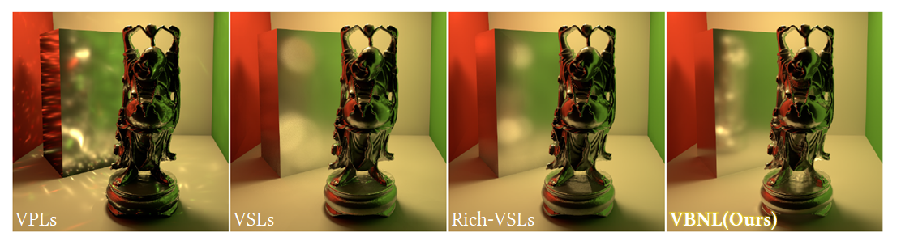

# Virtual Blue Noise Lighting (VBNL)

> https://graphics.cs.utah.edu/research/projects/virtual-blue-noise-lighting/

Virtual Blue Noise Lighting is a rendering pipeline for estimating indirect illumination with a blue noise distribution of virtual lights. Our pipeline is designed for virtual lights with non-uniform emission profiles that are more expensive to store, but required for properly and efficiently handling specular transport.

Unlike the typical virtual light placement approaches that traverse light paths from the original light sources, we generate them starting from the camera. This avoids two important problems: wasted memory and computation with fully-occluded virtual lights, and excessive virtual light density around high-probability light paths. In addition, we introduce a parallel and adaptive sample elimination strategy to achieve a blue noise distribution of virtual lights with varying density. This addresses the third problem of virtual light placement by ensuring that they are not placed too close to each other, providing better coverage of the (indirectly) visible surfaces and further improving the quality of the final lighting estimation.

For computing the virtual light emission profiles, we present a photon splitting technique that allows efficiently using a large number of photons, as it does not require storing them. During lighting estimation, our method allows using both global power-based and local BSDF important sampling techniques, combined via multiple importance sampling. In addition, we present an adaptive path extension method that avoids sampling nearby virtual lights for reducing the estimation error.

We show that our method significantly outperforms path tracing and prior work in virtual lights in terms of both performance and image quality, producing a fast but biased estimate of global illumination.

#### TODO:
* Add scripts to automatically download medias and run demo scenes. 
* Clean the code and fix some confusing variable names.